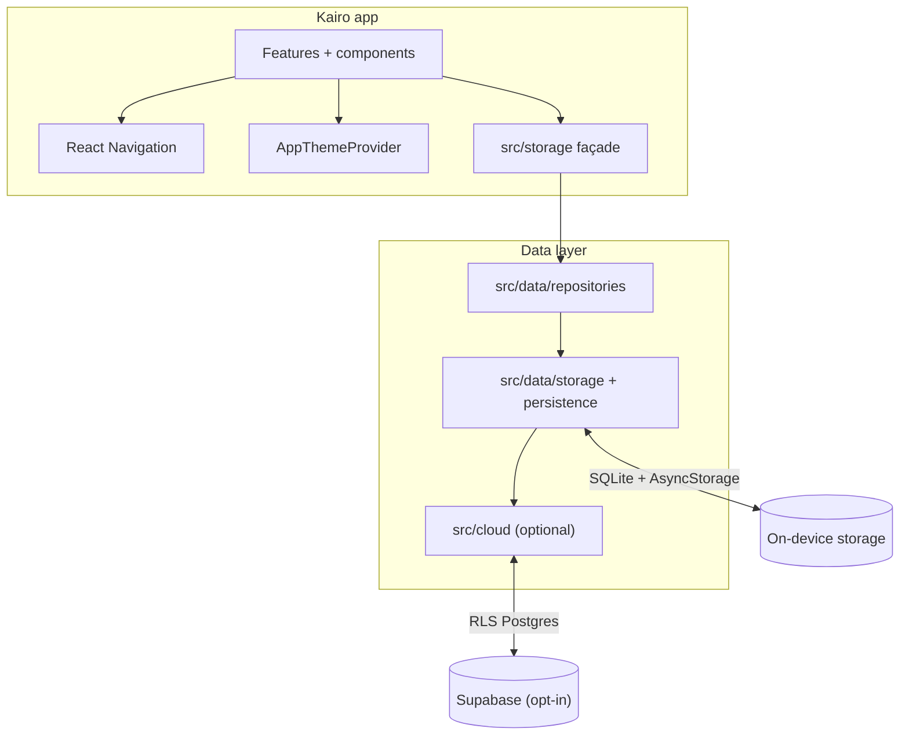

# ARCHITECTURE.md — Kairo

Living component map at repository root. For full layer model, import rules, hot paths, and examples, see **[docs/architecture.md](docs/architecture.md)** (canonical depth).

**Last reviewed:** 2026-07-30 · **Version:** 0.6.0

---

## System overview

Kairo is an Expo/React Native client with **no backend required** for core use. Persistence is SQLite + AsyncStorage behind a single **`src/storage`** façade. Optional Supabase sync lives in `src/cloud/` and activates only when env vars are set.

---

## Layer responsibilities

| Layer | Path | Owns |
|-------|------|------|
| **Bootstrap** | `src/bootstrap/` | RootApp, error boundary, splash, navigation-ready signal |
| **Features** | `src/features/*/screens/` | Screen orchestration per product area |
| **Components** | `src/components/` | Reusable UI (calendar, journal, glass tab bar, …) |
| **Extensions** | `src/extensions/` | Day-scoped slots (habits, goals, reminders) |
| **Navigation** | `src/navigation/` | Tab + stack wiring, FloatingTabBar |
| **Storage façade** | `src/storage/` | **Only** persistence API UI may import |
| **Repositories** | `src/data/repositories/` | Domain-shaped read/write APIs |
| **Storage impl** | `src/data/storage/`, `src/data/persistence/` | Validation, caches, SQLite, quarantine |
| **Cloud** | `src/cloud/` | Supabase auth, sync outbox (optional) |
| **Security** | `src/security/` | Redacted logger, console patch |
| **Theme** | `src/theme/` | Light/dark, tokens, appearance persistence |

---

## State model

- **No Redux/Zustand** — component state, React Navigation routes, `AppThemeContext`, and async reads/writes via `src/storage`.
- **Focus I/O** — screens defer storage reads with `InteractionManager.runAfterInteractions` where established.
- **Read models** — Daily Activity, insights bundles, calendar snapshots are derived; not separate write paths.

---

## Import boundaries (summary)

Enforced by ESLint (`eslint.config.cjs`):

- **UI** → may import `storage`, `components`, `utils`, `theme`, `types`, `security`
- **UI** → must **not** import AsyncStorage, `src/data/storage/*`, or deep `src/data/*`
- **Pure helpers** → no React, navigation, or persistence
- **Storage impl** → no screens, components, or navigation

Wrong vs right examples: [docs/architecture.md](docs/architecture.md) § Wrong vs right imports.

---

## Key product surfaces → code

| Surface | Primary paths |
|---------|---------------|
| Today | `src/features/today/` |
| Calendar (year + month) | `src/features/calendar/`, `src/components/calendar/` |
| Journal | `src/features/journal/` |
| Goals | `src/features/goals/`, `src/extensions/` |
| Reminders | `src/features/reminders/screens/TodoScreen.tsx` |
| Settings | `src/features/settings/` (modal stack) |
| Insights (v0.6) | `src/data/repositories/insightsRepository.ts`, `src/lib/insights/` |

Plain-English map: [docs/CODEBASE_MAP.md](docs/CODEBASE_MAP.md).

---

## Data contract

Storage keys, blob versions, and migration rules: **[src/data/DATA_CONTRACT.md](src/data/DATA_CONTRACT.md)**.

Safety and integrity: [docs/DATA_SAFETY.md](docs/DATA_SAFETY.md), [docs/DATA_ARCHITECTURE.md](docs/DATA_ARCHITECTURE.md).

---

## Related documentation

| Doc | Purpose |
|-----|---------|
| [docs/architecture.md](docs/architecture.md) | **Canonical** depth: hot paths, perf, import examples |
| [docs/AGENTS.md](docs/AGENTS.md) | Product constitution |
| [TECHNICAL.md](TECHNICAL.md) | Toolchain, boot sequence, ADRs, validate matrix |
| [.hermes/ARCHITECTURE_PRINCIPLES.md](.hermes/ARCHITECTURE_PRINCIPLES.md) | Design invariants |
| [docs/ARCHITECTURE_STATE.md](docs/ARCHITECTURE_STATE.md) | Current persistence snapshot |
