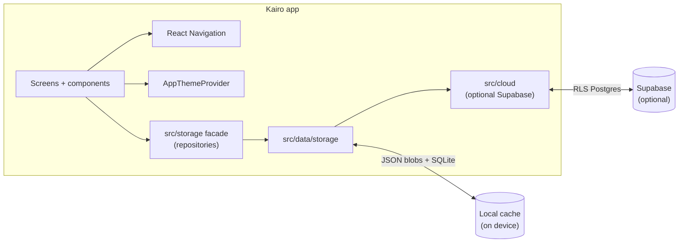

# Kairo

### Local-first mood tracking for iOS and Android — built with [Expo](https://expo.dev) and [React Native](https://reactnative.dev)

**Kairo v0.6** (release **0.6.0**) is a **daily mood + journal** app with an iOS-native feel: **Today**, **Calendar** (year grid + month timeline), **Journal**, **Goals**, **Reminders**, and **Settings**. Data is **local-first** on device (SQLite + AsyncStorage); **optional Supabase cloud sync** is available when you configure env vars — no account required for core journaling. The product line is **intentionally pre-1.0** — refining foundations, not claiming a “2.0” platform; see [`docs/CHANGELOG.md`](./docs/CHANGELOG.md) § Versioning and [`docs/AGENTS.md`](./docs/AGENTS.md) § Product maturity & versioning.

**Elevator pitch:** One calm place to log how your day felt, skim the year at a glance, read back journal lines, and keep lightweight goals/reminders nearby — with a **floating glass tab bar**, shared **mood + note** editing everywhere, and documentation aimed at **shipping** (tests, CI, App Store–style hygiene) without turning the product into a spreadsheet.

**Repository:** [github.com/maxiguillermo1/kairo](https://github.com/maxiguillermo1/kairo)

**Changelog (high level):** [`docs/CHANGELOG.md`](./docs/CHANGELOG.md) · **Engineering log:** [`docs/summary.md`](./docs/summary.md) · **All docs:** [`docs/README.md`](./docs/README.md)

**Contributor read order:** [`docs/ZERO_COMPROMISE.md`](./docs/ZERO_COMPROMISE.md) → [`docs/CODEBASE_MAP.md`](./docs/CODEBASE_MAP.md) → [`docs/architecture.md`](./docs/architecture.md) → [`docs/DATA_SAFETY.md`](./docs/DATA_SAFETY.md) → [`docs/RISK_REGISTER.md`](./docs/RISK_REGISTER.md) → [`docs/ROADMAP.md`](./docs/ROADMAP.md)

---

## Project identity

| Field | Value |
|--------|--------|
| **Display name** | Kairo (`Kairo (Dev)` in development builds) |
| **npm package** | `kairo` |
| **Expo slug** | `kairo` |
| **Deep link scheme** | `kairo://` |
| **iOS bundle ID** | `com.maxiguillermo.kairo` |
| **Android package** | `com.maxiguillermo.kairo` |
| **Storage key prefix** | `kairo.*` (AsyncStorage + export envelopes) |
| **SQLite database** | `kairo.db` |
| **Config source of truth** | [`app.config.ts`](./app.config.ts) · [`package.json`](./package.json) · [`eas.json`](./eas.json) |

> **Renamed from Moodly:** Existing installs and **`moodly.localExport.v1`** backup files are migrated automatically (AsyncStorage key rename + legacy export import). See [Migration from Moodly](#migration-from-moodly) below.

---

## Why this exists

Many mood apps want accounts, feeds, or cloud sync first. Kairo is for people who want **something small and local**: tap a grade, jot a line, see patterns on a calendar, and leave. The goal is **low friction** and **predictable privacy** — your entries stay on the phone unless *you* move them.

---

## What makes it different

**1. Local-first by design.**  
No network required for core journaling. Storage is validated, **quarantined** on corruption, and written with **serialized** mutations so rapid saves do not clobber each other. Optional **Supabase** sync is opt-in via env configuration.

**2. Calendar as the hero surface.**  
A **year pager** and a **month timeline** share the same **local `YYYY-MM-DD`** semantics (no accidental UTC “day shift” near midnight).

**3. One mood entry pattern everywhere.**  
**Today**, the **calendar day sheet**, and **Journal** use the same **Mood / Note** affordances so muscle memory transfers.

**4. Built like a product, not a demo.**  
Structured **privacy-safe logging**, ESLint **import boundaries**, **Jest** coverage on dates/storage, and CI that runs **Metro bundle export** for **iOS + Android** — see [Quality & CI](#quality--ci).

**5. Optional cloud account (when configured).**  
Sign in with Apple, Google, or email to sync mood, habits, goals, and reminders to **Supabase Postgres** with row-level security — see [`docs/SUPABASE.md`](./docs/SUPABASE.md).

---

## Who this is for

- People who want a **simple mood + note** ritual without social features  
- Anyone who prefers **on-device** journaling until they explicitly choose otherwise  
- Contributors who care about **performance on scroll** (calendar hot paths, FlashList journal list) and **maintainable** layering

If you want multi-device sync, social sharing, or clinical workflows out of the box, Kairo is **not** that — and that is intentional.

---

## Important disclaimers

- **Not medical advice.** Kairo is a **personal logging** tool, not a diagnosis or treatment service.  
- **You own backups.** Uninstalling the app or losing the device can mean losing local data unless you have a platform backup strategy.  
- **No warranty.** The software is provided **“as is”** — see [`LICENSE`](./LICENSE).  
- **Review storage keys** before fork integrations: [`src/data/DATA_CONTRACT.md`](./src/data/DATA_CONTRACT.md).

For privacy and logging rules (what never goes in logs), see [`docs/SECURITY_CHECKLIST.md`](./docs/SECURITY_CHECKLIST.md) and [`docs/logger.md`](./docs/logger.md).

---

## Main screens (+ Reminders & settings)

Plain language: what you actually open in the app.

| Surface | What it does |
|--------|----------------|
| **Today** | Log **today’s** mood and note in one card; save persists immediately to local storage. |
| **Calendar** | **Year** swipe grid opens the **month** timeline; tap a **day** to view or edit that date’s entry. |
| **Journal** | Newest-first list of entries; open editor, save, long-press to delete. |
| **Reminders** (stack **`Todo`**) | Full **Reminders** screen for one **`YYYY-MM-DD`**: hot day rows in **`kairo.tasks.day.<date>`** shards; metadata/recurrence in **`kairo.tasks`** (legacy **`kairo.dayTodos`** migrates once), optional time-of-day cues (in-app only), drag reorder / swipe delete; opened from **Today** strip, **Journal** / **Calendar** day flows, or **Settings**. |
| **Settings** | Appearance (**Auto / Light / Dark**), calendar style (**dot / fill**), mood visuals (**solid / gradient**), **Extensions** (Habits, Goals, **Reminders** per-day list), **Export / Import** JSON backup, optional **Account** (cloud sync), stats, About (version from `APP_RELEASE_VERSION`). |

**Settings** opens as a **modal** (not a tab), from headers where a gear is shown (including Calendar).

---

## How it works

```
You log mood + note  →  Kairo validates + writes local storage  →  Calendar / Journal read the same local-day keys
                                              ↓ (optional, when Supabase configured)
                                    Cloud sync push / pull via outbox
```

### Simple picture

- **You** interact with **React Native** screens (tabs + stacks).  
- **Expo** supplies the native shell, splash, and toolchain (`npm run ios` / `android` / `web`).  
- **Persistence** is **SQLite + AsyncStorage** behind **`src/storage`** — screens never import raw storage implementation paths.
- **Cloud** (optional): `src/cloud/` handles Supabase auth + sync; UI still imports **`src/storage`** only.

### Architecture (for curious readers)



On boot, **`AppErrorBoundary`** (inside **`AppThemeProvider`**) can catch a subtree failure and offer **Try again** instead of a blank screen — see `src/bootstrap/AppErrorBoundary.tsx`.

---

## Quick start

> **What you need:** [Node.js](https://nodejs.org/) (LTS recommended), npm, and optionally **Xcode** / **Android Studio** for simulators. For device testing, [Expo Go](https://expo.dev/go) is enough for development.

### 1. Install dependencies

```bash
git clone https://github.com/maxiguillermo1/kairo.git kairo
cd kairo
npm install
```

### 2. Run the dev server

```bash
npm run start
```

Then press **`i`** / **`a`** for iOS / Android in Expo CLI, or scan the QR code with **Expo Go**.

### 3. Native runs (optional)

```bash
npm run ios
npm run android
```

### 4. Example flows to smoke-test

| You do | What you should see |
|--------|---------------------|
| **Today** → pick mood → note → **Save** | Entry persists after force-quit |
| **Calendar** → swipe year → open month → tap day | Sheet opens; save updates dot/card |
| **Journal** → edit → **Save** | Row updates; order stays newest-first |
| **Settings** → **Reminders** (Extensions) | Opens **Reminders** for today when tapped; toggle controls Today strip |
| **Settings** → **Appearance** | Auto/Light/Dark persists |

**Web:** `npm run web` works for previews; native is the primary target — see [`docs/WEB_DEPLOYMENT_CHUNKS.md`](./docs/WEB_DEPLOYMENT_CHUNKS.md).

### 5. Optional — enable cloud sync (Supabase)

Copy [`.env.example`](./.env.example) to `.env` and set:

```bash
EXPO_PUBLIC_SUPABASE_URL=https://YOUR_PROJECT.supabase.co
EXPO_PUBLIC_SUPABASE_ANON_KEY=your-anon-key
```

Apply the Postgres schema from [`supabase/migrations/20260520100000_kairo_cloud_schema.sql`](./supabase/migrations/20260520100000_kairo_cloud_schema.sql). Configure auth redirect URLs as **`kairo://auth/callback`**. Full guide: [`docs/SUPABASE.md`](./docs/SUPABASE.md).

Without these vars, Kairo runs **local-only** (default).

### 6. After cloning or renaming the project folder

```bash
rm -rf node_modules .expo .metro-cache .tmp-expo-export
npm install
npm run start:clear   # or: npx expo start --clear
```

If the repo path contains **spaces**, Expo Go on a physical device may fail — run `npm run fix:dev-path`.

---

## Stack (current)

| Layer | Choice |
|--------|--------|
| App runtime | **Expo SDK ~54**, **React Native 0.81.x**, **React 19.x** |
| Navigation | **React Navigation v7** (bottom tabs + native stack) |
| Lists | **@shopify/flash-list** (calendar timeline + journal); **FlatList** (year pager) |
| Materials | **expo-blur** (`LiquidGlass`), **expo-haptics**, **reanimated** |

Full dependency list: [`package.json`](./package.json).

---

## Quality & CI

**Local gates:**

```bash
npm run validate
```

**Before release, or before changing Metro, Babel, `app.config.ts`, or `eas.json`, run:**

```bash
npm run validate:release
```

This includes typecheck, lint, full Jest, focused storage/persistence stress, Expo Doctor, and iOS/Android bundle export.

**Fast iOS / App Store candidate gate** (typecheck, lint, Jest, storage stress, doctor, iOS export, prod audit):

```bash
npm run validate:ios-release
```

**Focused storage/data stress gate only:** `npm run test:storage-stress`

**Faster (iOS-only) bundle check:** `npm run export:ios-check`

**CI:** pushes and PRs to `main` run `npm run validate:release` — [`.github/workflows/ci.yml`](./.github/workflows/ci.yml) (timeout **20 minutes**).

Optional **`.env`** — see [`.env.example`](./.env.example). Common variables:

| Variable | Purpose |
|----------|---------|
| `EXPO_PUBLIC_SUPABASE_URL` | Supabase project URL (optional cloud sync) |
| `EXPO_PUBLIC_SUPABASE_ANON_KEY` | Supabase anon key (optional cloud sync) |
| `APP_VARIANT` | EAS channel: `production` · `development` · `preview` |
| `EXPO_PUBLIC_PRIVACY_POLICY_URL` | HTTPS legal URL for App Store / Play |
| `EXPO_PUBLIC_TERMS_URL` | HTTPS terms URL |
| `KAIRO_ALLOW_SPACED_PATH` | Dev override when project path has spaces |
| `EXPO_PUBLIC_KAIRO_PERF_PROBE` | Dev perf logging (off by default) |

Core journaling requires **no API keys**.

**Native config** lives in **`app.config.ts`** (icons, bundle IDs, splash). Validate splash on **`npx expo run:ios`** / **`run:android`** or an EAS build — not only Expo Go.

### Store deployment (EAS)

Full guide: **[`docs/DEPLOYMENT.md`](./docs/DEPLOYMENT.md)**

```bash
npm install -g eas-cli
eas login
eas init
npm run validate:release
npm run build:ios:production      # or build:android:production
npm run submit:ios                # after TestFlight QA
```

Replace placeholder icons under **`assets/images/`** before public App Store marketing.

---

## Project structure (abbreviated)

```
kairo/
├── App.tsx                    # Re-exports src/App (Expo entry)
├── README.md                  # Project overview (you are here)
├── LICENSE
├── app.config.ts              # Expo name, slug, scheme, bundle IDs
├── eas.json                   # EAS build profiles
├── package.json               # npm name: kairo
├── assets/images/
├── src/
│   ├── App.tsx                # Gesture handler + safe console + RootApp
│   ├── bootstrap/             # RootApp, AppErrorBoundary
│   ├── cloud/                 # Supabase auth + sync (optional)
│   ├── components/
│   ├── data/                  # repositories, storage, persistence, sync
│   ├── extensions/            # Day-scoped extension stack (Habits / Goals / Reminders)
│   ├── features/              # Route screens by product area (today, journal, calendar, …)
│   ├── navigation/
│   ├── storage/               # Public persistence façade (import from here in UI)
│   ├── theme/
│   └── ...
├── supabase/
│   └── migrations/            # Postgres schema for optional cloud sync
└── docs/                      # Developer guides — see docs/README.md
    ├── README.md              # Documentation index
    ├── AGENTS.md
    ├── SUPABASE.md
    ├── SCALABILITY.md
    ├── CONTRIBUTING.md
    ├── architecture.md
    └── ...
```

Mechanical map: [`docs/PROJECT_STRUCTURE.md`](./docs/PROJECT_STRUCTURE.md). **Plain-English feature ↔ folder map:** [`docs/CODEBASE_MAP.md`](./docs/CODEBASE_MAP.md).

---

## Migration from Moodly

Kairo was renamed from **Moodly** (repo, app name, bundle IDs, and storage keys). Existing data is preserved:

| Area | Behavior |
|------|----------|
| **AsyncStorage keys** | Automatic migration renames `moodly.*` → `kairo.*` (schema v2) |
| **SQLite** | New `kairo.db`; `moodly_meta` table renamed to `kairo_meta` when present; mood/habit/goal rows re-import from local cache |
| **JSON export / import** | New exports use `kairo.localExport.v1`; **Settings → Import** still accepts legacy **`moodly.localExport.v1`** files |
| **App Store / Play ID** | **`com.maxiguillermo.kairo`** is a **new** bundle identifier (not an in-place rename of `com.moodly.app`) |
| **Deep links / auth** | Use scheme **`kairo://`** (update Supabase redirect URLs if using cloud sync) |

After pulling the rename commit, run `npm install` and `npm run start:clear` (or clear caches as in [Quick start §6](#6-after-cloning-or-renaming-the-project-folder)).

---

## Documentation index

| Doc | Purpose |
|-----|---------|
| [`docs/CODEBASE_MAP.md`](./docs/CODEBASE_MAP.md) | Plain-English map: features ↔ `src/` paths, naming rules, agent checklist |
| [`docs/SUPABASE.md`](./docs/SUPABASE.md) | Optional cloud sync: auth, Postgres schema, env setup |
| [`docs/DEPLOYMENT.md`](./docs/DEPLOYMENT.md) | EAS builds, native release channels |
| [`docs/DATA_ARCHITECTURE.md`](./docs/DATA_ARCHITECTURE.md) | Local SQLite + AsyncStorage layering |
| [`docs/README.md`](./docs/README.md) | Index of everything in **`docs/`** |
| [`docs/AGENTS.md`](./docs/AGENTS.md) | Master guide: product identity, UX/iOS standards, Goals & Reminders, data scale, agent profiles |
| [`docs/FEATURES.md`](./docs/FEATURES.md) | Feature map and code pointers |
| [`.cursor/rules/`](./.cursor/rules/) | Cursor **`.mdc`** rules (`kairo-core`, `kairo-data-storage`, `kairo-ui-screens`) |
| [`docs/CONTRIBUTING.md`](./docs/CONTRIBUTING.md) | Contributor workflow + standards |
| [`docs/ENGINEERING_HANDOFF.md`](./docs/ENGINEERING_HANDOFF.md) | First-read onboarding |
| [`docs/architecture.md`](./docs/architecture.md) | **Canonical** architecture + ESLint import rules |
| [`docs/PROJECT_STRUCTURE.md`](./docs/PROJECT_STRUCTURE.md) | Folder tree |
| [`docs/DESIGN_SYSTEM.md`](./docs/DESIGN_SYSTEM.md) | Theme, LiquidGlass, splash, appearance |
| [`docs/COMPONENTS.md`](./docs/COMPONENTS.md) | Reusable UI + storage façade usage |
| [`docs/TESTING.md`](./docs/TESTING.md) | Jest, TZ, CI |
| [`docs/APP_STORE_READINESS.md`](./docs/APP_STORE_READINESS.md) | Native release checklist |
| [`docs/MOBILE_PRODUCTION_AUDIT.md`](./docs/MOBILE_PRODUCTION_AUDIT.md) | Production polish audit (stability, perf, a11y, store gaps) |
| [`docs/WEB_DEPLOYMENT_CHUNKS.md`](./docs/WEB_DEPLOYMENT_CHUNKS.md) | Web sequencing (optional) |
| [`docs/CHANGELOG.md`](./docs/CHANGELOG.md) | Product-facing changelog |
| [`docs/DECISIONS.md`](./docs/DECISIONS.md) | Long-lived decisions |
| [`docs/logger.md`](./docs/logger.md) | Logging + perf probe legend |
| [`docs/SECURITY_CHECKLIST.md`](./docs/SECURITY_CHECKLIST.md) | Privacy checklist |
| [`docs/summary.md`](./docs/summary.md) | Engineering log (milestones) |
| [`docs/SCALABILITY.md`](./docs/SCALABILITY.md) | Scale index: shards, caps, hot paths, links to perf + data docs |
| [`src/data/DATA_CONTRACT.md`](./src/data/DATA_CONTRACT.md) | Storage keys |

---

## Contributing

See **[`docs/CONTRIBUTING.md`](./docs/CONTRIBUTING.md)** for quality gates, layer rules, and PR expectations. **AI / Cursor:** start with **[`docs/AGENTS.md`](./docs/AGENTS.md)** and **`.cursor/rules/kairo-*.mdc`**. The repo includes **[`.editorconfig`](./.editorconfig)** for consistent basic formatting across editors.

Improvements are welcome: bug fixes, documentation, performance work on calendar/journal hot paths, and tests that protect **date** and **storage** invariants.

- Match existing **layering** (UI → `src/storage` only; no direct AsyncStorage in screens).  
- Run **lint / typecheck / tests**; for persistence work add **`test:storage-stress`**; for iOS release prep use **`validate:ios-release`**; for risky native/config changes use **`validate:release`** (or at least **`doctor`** + **`export:bundles-check`**).  
- Use [`.github/pull_request_template.md`](./.github/pull_request_template.md) as a guide.

---

## Philosophy

> *The best habit tracker is the one you can open without dread.*

Kairo favors **calm defaults**: readable typography, **accessible** labels where it matters, and **no clutter** — just mood, note, calendar, and journal.

---

## License

**MIT** — see [`LICENSE`](./LICENSE).

**THE SOFTWARE IS PROVIDED "AS IS", WITHOUT WARRANTY OF ANY KIND.** The authors are not liable for claims or damages arising from use. You are responsible for your data and for any regulatory obligations if you fork and ship a derivative.

---

<p align="center">
  <i>Kairo — mood, note, calendar, journal, reminders. On your device.</i>
  <br><br>
  <a href="./docs/ENGINEERING_HANDOFF.md"><strong>Engineering handoff</strong></a> ·
  <a href="./docs/CHANGELOG.md"><strong>Changelog</strong></a> ·
  <a href="./docs/APP_STORE_READINESS.md"><strong>Release checklist</strong></a> ·
  <a href="./docs/TESTING.md"><strong>Testing</strong></a>
</p>
