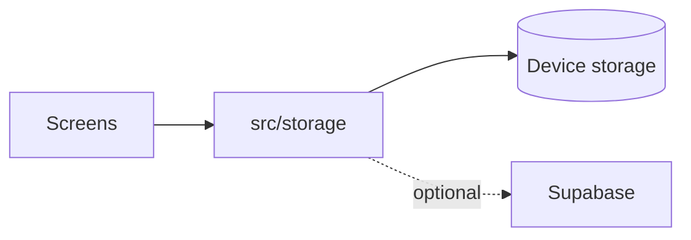

# Kairo

Local-first mood tracking for iOS and Android — a calm place to log how your day felt and revisit it on a year-scale color calendar.

**Version:** 0.6.0 · **Repository:** [github.com/maxiguillermo1/kairo](https://github.com/maxiguillermo1/kairo)

---

## What is this?

Kairo is a **daily mood + journal** app. You pick a mood grade, write a short note, and browse your history on a **calendar** (year grid + month timeline) and **journal** list. Optional **habits**, **goals**, and **reminders** add gentle context around your emotional timeline — they are not the main focus.

Data stays **on your phone** unless you choose optional cloud sync.

---

## Why was it built?

Many mood apps want accounts, feeds, or cloud-first sync. Kairo is for people who want **something small and local**: tap a grade, jot a line, see patterns on a calendar, and leave — with **predictable privacy** and no required sign-in.

---

## The problem

Journaling apps often add friction (accounts, social features, analytics) or shift your entries to the cloud by default. That makes it harder to build a private, low-pressure daily habit.

---

## The solution

A **local-first** app with an iOS-native feel: **Today**, **Calendar**, **Journal**, **Goals**, **Reminders**, and **Settings**. One shared mood + note pattern everywhere. Optional **Supabase** backup/sync when you configure it yourself.

---

## How it works

1. You log mood + note on **Today** or from the calendar day sheet.
2. Kairo **validates and writes** to on-device storage (SQLite + AsyncStorage).
3. **Calendar** and **Journal** read the same local-day data.
4. If Supabase is configured and you sign in, an **outbox** syncs to your cloud project.



Boot resilience: `AppErrorBoundary` offers retry on subtree failures. Details: [ARCHITECTURE.md](ARCHITECTURE.md).

---

## Technologies used

| Technology | What it is |
|------------|------------|
| **Expo** | A toolkit that wraps React Native so you can build iOS/Android apps with one codebase and simpler native tooling. |
| **React Native** | A framework for building mobile apps using JavaScript/TypeScript and native UI components. |
| **TypeScript** | JavaScript with static types — catches many bugs before runtime. |
| **SQLite** | A small on-device database (via `expo-sqlite`) for structured mood/habit/goal data. |
| **AsyncStorage** | Key-value storage on the device for settings and some legacy blobs. |
| **Supabase** (optional) | An open-source backend service (Postgres + auth). Kairo uses it only when you set env vars — for optional cloud sync, not for core offline use. |
| **EAS** | Expo Application Services — cloud builds and store submission for iOS/Android. |

No large language model (LLM) or AI service is required to use Kairo. v0.6 includes a **local, deterministic** reflection engine (no cloud AI).

---

## Software requirements

- **Node.js** LTS (18+ recommended)
- **npm**
- **Xcode** (macOS, for iOS simulator) or **Android Studio** (for Android emulator) — optional; **Expo Go** works for development on a physical device

---

## Installation

```bash
git clone https://github.com/maxiguillermo1/kairo.git kairo
cd kairo
npm install
```

---

## Usage

```bash
npm run start          # Expo dev server — press i/a for simulators or scan QR with Expo Go
npm run ios            # iOS simulator
npm run android        # Android emulator
npm run web            # Web preview (native is primary)
```

**Smoke test:** Today → mood → note → Save → force-quit → reopen → entry persists.

**Optional cloud sync:** copy [`.env.example`](.env.example) to `.env`, set Supabase URL and anon key, apply [schema](supabase/migrations/). Guide: [docs/SUPABASE.md](docs/SUPABASE.md).

**After clone or folder rename:**

```bash
rm -rf node_modules .expo .metro-cache .tmp-expo-export
npm install
npm run start:clear
```

---

## Project structure

| Folder / file | Purpose |
|---------------|---------|
| `src/features/` | Screen modules (today, calendar, journal, goals, …) |
| `src/components/` | Reusable UI |
| `src/storage/` | **Public persistence API** — screens import here |
| `src/data/` | Storage implementation, repositories, SQLite |
| `src/cloud/` | Optional Supabase auth + sync |
| `src/navigation/` | Tab bar and stacks |
| `docs/` | Full developer documentation (54 files) |
| `.hermes/` | Engineering standards and policies |
| `app.config.ts` | Expo config (bundle IDs, icons, version) |
| `eas.json` | EAS build profiles |

Full tree: [docs/PROJECT_STRUCTURE.md](docs/PROJECT_STRUCTURE.md) · Plain-English map: [docs/CODEBASE_MAP.md](docs/CODEBASE_MAP.md).

---

## Quality gates

```bash
npm run validate              # typecheck + lint + test
npm run validate:release      # full CI gate (before native/config changes)
```

CI runs `validate:release` on every PR to `main`. See [CONTRIBUTING.md](CONTRIBUTING.md).

---

## FAQ

**Do I need an account?** No — core journaling works fully offline.

**Is my data sent to Kairo's servers?** No. Data stays on device unless you configure your own Supabase project and sign in.

**Was this called Moodly?** Yes. Kairo renamed from Moodly; legacy exports and storage keys migrate automatically. See [docs/CHANGELOG.md](docs/CHANGELOG.md).

**Is this medical advice?** No — personal logging only, not diagnosis or treatment.

---

## Future roadmap

Pre-1.0 refinement toward v1.0: data ownership UX, release hardening, optional cloud polish. Summary: [ROADMAP.md](ROADMAP.md) · Full plan: [docs/ROADMAP.md](docs/ROADMAP.md).

---

## Documentation

| Audience | Start here |
|----------|------------|
| New user / contributor | This README |
| Contributor | [CONTRIBUTING.md](CONTRIBUTING.md) |
| Engineer | [TECHNICAL.md](TECHNICAL.md) · [ARCHITECTURE.md](ARCHITECTURE.md) |
| AI agent | [PROJECT_MANIFEST.md](PROJECT_MANIFEST.md) · [docs/AGENTS.md](docs/AGENTS.md) |
| Everything in `docs/` | [docs/README.md](docs/README.md) |

---

## License

**MIT** — see [LICENSE](LICENSE). THE SOFTWARE IS PROVIDED "AS IS", WITHOUT WARRANTY OF ANY KIND.
