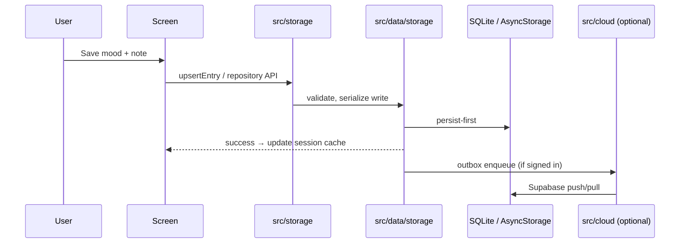

# TECHNICAL.md — Kairo

Senior-engineer technical reference.  
For plain-language overview, see [README.md](README.md). For layer depth and import examples, see [docs/architecture.md](docs/architecture.md).

**Last reviewed:** 2026-07-30 · **Version:** 0.6.0

---

## System architecture

Kairo is a single-client Expo app. All product logic runs on device. Optional Supabase provides auth + Postgres sync when configured; the app remains fully functional offline without it.



---

## Toolchain (exact versions from package.json)

| Package | Version |
|---------|---------|
| **kairo** (app) | 0.6.0 |
| **expo** | ~54.0.36 |
| **react** | 19.1.0 |
| **react-native** | 0.81.5 |
| **@react-navigation/native** | ^7.0.0 |
| **@react-navigation/bottom-tabs** | ^7.0.0 |
| **@react-navigation/native-stack** | ^7.0.0 |
| **react-native-screens** | 4.16.0 |
| **react-native-gesture-handler** | ~2.28.0 |
| **react-native-reanimated** | 4.1.1 |
| **react-native-safe-area-context** | 5.6.0 |
| **@shopify/flash-list** | 2.0.2 |
| **@supabase/supabase-js** | 2.105.4 |
| **@react-native-async-storage/async-storage** | 2.2.0 |
| **expo-sqlite** | ~16.0.10 |
| **jest** | ^29.7.0 |
| **jest-expo** | ~54.0.4 |
| **typescript** | ^5.3.0 |
| **eslint** | ^9.17.0 |

Host baseline (measured): [docs/engineering/TOOLCHAIN_BASELINE.md](docs/engineering/TOOLCHAIN_BASELINE.md).

---

## Repository layout

```text
src/
├── bootstrap/       # RootApp, AppErrorBoundary, splash coordination
├── cloud/           # Supabase auth + sync (optional)
├── components/      # Shared UI
├── data/
│   ├── repositories/   # Domain facades (entries, settings, insights, …)
│   ├── storage/        # AsyncStorage impl, validation, caches
│   └── persistence/    # SQLite migrations and adapters
├── extensions/      # Day extension registry + slots
├── features/          # Screen modules by product area
├── lib/               # Pure helpers (calendar math, insights engine, …)
├── navigation/        # RootNavigator, stacks, FloatingTabBar
├── security/          # Logger facade
├── storage/           # Public API — UI imports here
└── theme/             # AppThemeProvider, tokens
```

Mechanical tree: [docs/PROJECT_STRUCTURE.md](docs/PROJECT_STRUCTURE.md).

---

## Component ownership

| Component | Module | Responsibility |
|-----------|--------|----------------|
| App entry | `src/App.tsx` | Gesture handler, safe console, perf probe opt-in |
| Bootstrap | `src/bootstrap/RootApp.tsx` | Providers, nav container, storage prime |
| Mood entries | `src/data/storage/moodStorage.ts` | Entries CRUD, session cache, month index |
| Settings | `src/data/storage/settingsStorage.ts` | Appearance, extensions toggles |
| Tasks / reminders | `src/data/storage/tasksStorage.ts` | Day shards + metadata |
| Goals | `src/data/storage/goalsStorage.ts` | Goals blob + milestones |
| Insights | `src/data/repositories/insightsRepository.ts` | Weekly/monthly reflection bundles |
| Cloud sync | `src/cloud/` | Auth context, outbox, Supabase client |
| Calendar perf | `src/features/calendar/` | Year pager + month FlashList timeline |

---

## Boot / initialization lifecycle

1. **`App.tsx`** — `react-native-gesture-handler` import, `installSafeConsole()`, optional perf probe.
2. **`RootApp`** — `primeAppStorageCritical()` (migrations, non-blocking), splash prevent auto-hide.
3. **Providers** — `GestureHandlerRootView` → `SafeAreaProvider` → `AppThemeProvider` → `AuthProvider` → `AppErrorBoundary`.
4. **`NavigationContainer`** — themed, perf-instrumented; `RootNavigator` mounts tab + stack.
5. **`warmAppStorageSession()`** — deferred full storage warm after first paint.
6. **Splash hide** — after navigation ready + minimum display time.

Entry config: `expo/AppEntry.js` → `App.tsx` (see `package.json` `"main"`).

---

## Data flow

**Write path:** Screen → `src/storage` repository → validate at data boundary → serialize write lock → SQLite/AsyncStorage → update session cache → optional cloud outbox.

**Read path:** Screen focus → deferred `InteractionManager` read → repository → cache or storage → snapshot to UI state.

**Read models:** `dailyActivityRepository`, `insightsRepository`, calendar snapshots compose multiple stores without persisting a parallel copy.

Contract: [src/data/DATA_CONTRACT.md](src/data/DATA_CONTRACT.md).

---

## State flow

- Route state: React Navigation (tabs + Settings modal stack).
- Theme: `AppThemeContext` (`useAppTheme()`).
- Today key: `useTodayKey()` — single midnight timer + AppState resync.
- No global Redux/Zustand store.

---

## Storage layout

| Store | Key / file | Contents |
|-------|------------|----------|
| SQLite | `kairo.db` | Mood entries (migrated), habits, goals metadata |
| AsyncStorage | `kairo.*` | Settings, task shards, legacy blobs |
| Secure store | expo-secure-store | Auth tokens when cloud enabled |
| Quarantine | `kairo.<key>.corrupt.<timestamp>` | Backup of corrupt values |

---

## Configuration

| Source | Purpose |
|--------|---------|
| `app.config.ts` | Name, slug, `kairo://` scheme, bundle IDs, `APP_VARIANT` |
| `eas.json` | EAS profiles: development, preview, production |
| `.env` | `EXPO_PUBLIC_SUPABASE_*`, legal URLs, perf probe (local only) |
| `src/constants/app.ts` | `APP_RELEASE_VERSION` (must match package.json) |

---

## Logging

- UI: `logger` from `src/security` only (`no-console` in ESLint).
- Dev perf: `EXPO_PUBLIC_KAIRO_PERF_PROBE=1` enables `src/perf` probes.
- Production: WARN/ERROR metadata only; no note text or payload blobs.

Detail: [docs/logger.md](docs/logger.md).

---

## Security

- Local-first; no network for core journaling.
- Optional Supabase with RLS; anon key in client, user-scoped rows.
- No sensitive logging; storage treated as untrusted input.
- `npm run check:secrets` before release.

Summary: [SECURITY.md](SECURITY.md) · Checklist: [docs/SECURITY_CHECKLIST.md](docs/SECURITY_CHECKLIST.md).

---

## Validate matrix

| Gate | Command | When |
|------|---------|------|
| Standard | `npm run validate` | Most PRs (typecheck + lint + test) |
| Storage stress | `npm run test:storage-stress` | Persistence / schema changes |
| Release | `npm run validate:release` | CI, Metro/Babel/config/EAS changes |
| iOS release | `npm run validate:ios-release` | App Store candidate |
| Bundle check | `npm run export:ios-check` | Fast iOS-only export smoke |
| Circular deps | `npm run check:circular-deps` | Included in release gates |
| Secrets | `npm run check:secrets` | Included in release gates |
| Expo Doctor | `npm run doctor` | Native dependency health |

CI (`.github/workflows/ci.yml`): `validate:release` on push/PR to `main`.

---

## Testing

```bash
npm test                              # full Jest suite, TZ=America/Los_Angeles
npm run test:storage-stress           # persistence focus
NODE_ENV=test npm run test -- --watch # local iteration
```

Calendar, date, and storage tests are highest priority for regression coverage. Guide: [docs/TESTING.md](docs/TESTING.md).

---

## Deployment

- **EAS profiles:** `development` (dev client), `preview` (internal), `production` (store, autoIncrement).
- **Build:** `npm run build:ios:production` / `build:android:production`
- **Submit:** `npm run submit:ios` / `submit:android`

Full guide: [docs/DEPLOYMENT.md](docs/DEPLOYMENT.md).

---

## Failure handling

- `AppErrorBoundary` — subtree crash → Try again UI.
- Storage corruption → quarantine + safe default (no crash loop).
- Bootstrap migrations → `runBootstrapWithRetry` (3×) on cold start.
- Cloud sync failures → offline-first; local data authoritative until merge.

---

## Performance

Hot paths: calendar month FlashList, year pager, journal sorted list. Budgets and baselines: [docs/engineering/PERFORMANCE_BUDGETS.md](docs/engineering/PERFORMANCE_BUDGETS.md), [docs/PERFORMANCE.md](docs/PERFORMANCE.md).

---

## Architecture Decision Records (index)

Canonical long-form decisions: [docs/DECISIONS.md](docs/DECISIONS.md).

| ADR | Title | Status |
|-----|-------|--------|
| ADR-001 | Local `YYYY-MM-DD` date keys (not UTC) | Accepted |
| ADR-002 | 0-based month index in calendar UI | Accepted |
| ADR-003 | `useTodayKey()` single source for midnight rollover | Accepted |
| ADR-004 | Storage quarantine on corruption | Accepted |
| ADR-005 | Session caches invalidated on write | Accepted |
| ADR-006 | UI imports `src/storage` only | Accepted |
| ADR-007 | UTC date-key derivation banned in ESLint | Accepted |
| ADR-008 | No sensitive logging in UI | Accepted |
| ADR-009 | Calendar/list hot-path allocation guardrails | Accepted |
| ADR-010 | Local-first; optional Supabase opt-in | Accepted |

---

## Known limitations

- Pre-1.0 product line — storage and UX still refining toward v1.0.
- Web is preview-only; native iOS/Android are primary targets.
- Some AsyncStorage blobs remain (habits, goals) — SQLite migration ongoing.
- Cloud sync requires user-configured Supabase project (not hosted by Kairo).

---

## Future improvements

See [ROADMAP.md](ROADMAP.md) and [docs/ROADMAP.md](docs/ROADMAP.md): data ownership UX, full SQLite migration, physical-device release evidence, optional AI surfaces only after v1 trust bar.
