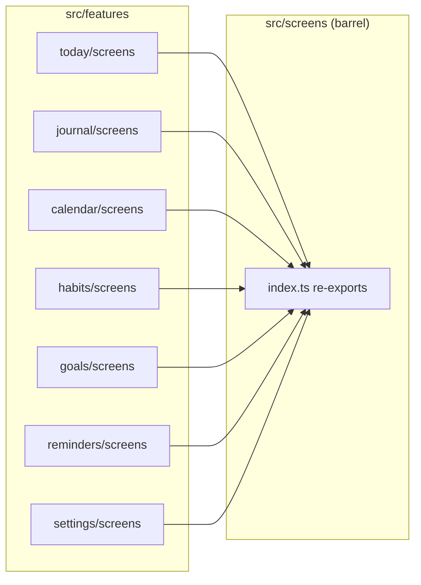
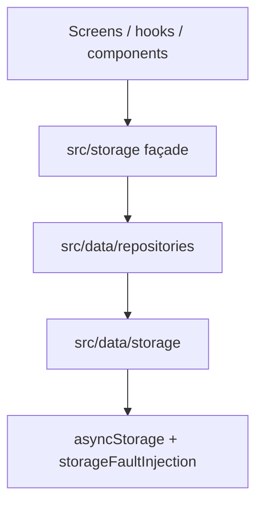
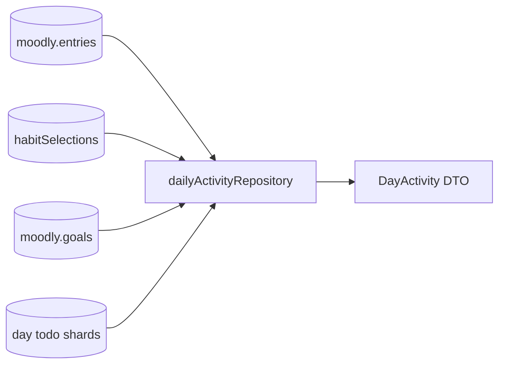
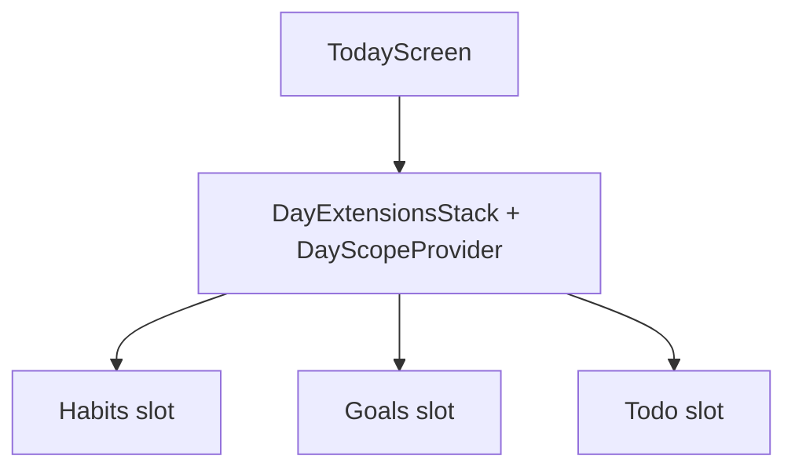

# Moodly — codebase map & naming (human + agent guide)

**Purpose:** answer “where does this live?” and “what do we call things?” in **plain English**, without moving folders every release.

**Canonical rules:** [`AGENTS.md`](./AGENTS.md) (product + non‑negotiables), [`architecture.md`](./architecture.md) (layers + ESLint boundaries), [`DATA_ARCHITECTURE.md`](./DATA_ARCHITECTURE.md) (persistence + repositories).

---

## 1. Logical features vs physical folders

Moodly uses **layer-first** folders for shared code (`components/`, `hooks/`, `data/`, …) and **`src/features/*/screens/`** for route-level UI. A thin **`src/screens/index.ts`** barrel re-exports screens so existing `from '../screens'` imports stay short.

| Feature | User surface | Canonical UI | Primary data / rules |
|--------|----------------|----------------|----------------------|
| **Today** | Today tab | `src/features/today/screens/TodayScreen.tsx` | `useMoodEntry`, `src/components/todayExtensions/*` |
| **Journal** | Journal tab | `src/features/journal/screens/JournalScreen.tsx`, `JournalEditModal.tsx` | `entriesRepository` / `moodStorage` |
| **Calendar** | Calendar tab | `src/features/calendar/screens/CalendarScreen.tsx`, `CalendarView.tsx` | `calendarSnapshotRepository`, `calendarSnapshot.ts`, `src/components/calendar/*`, `src/lib/calendar/*` |
| **Goals** | Goals stack | `src/features/goals/screens/GoalsScreen.tsx` | `goalsRepository`, `goalsStorage`, `src/lib/goals/goalMath.ts` |
| **Reminders** | Todo route | `src/features/reminders/screens/TodoScreen.tsx` | `tasksRepository`, `tasksStorage`, `useDayTodos` |
| **Habits** | Habits screen | `src/features/habits/screens/HabitsScreen.tsx` | `extensionsRepository`, `habitSelectionsStorage`, `habitTrackingStorage` |
| **Settings** | Settings modal | `src/features/settings/screens/SettingsScreen.tsx` | `settingsRepository`, `settingsStorage` |
| **Day extensions** | Shared host | `src/extensions/*` | `DayScopeContext`, `dayExtensionRegistry`, `dayExtensionSlots.tsx` |
| **Narrative (life timeline)** | Repository + pure engine | `src/data/repositories/narrativeRepository.ts`, `src/lib/narrative/*` | **`getDayActivityRange`** bounded window; see `docs/NARRATIVE.md` |
| **Insights (foundation)** | Repository + pure engine | `src/data/repositories/insightsRepository.ts`, `src/lib/insights/*`, `insightsReflectionStateStorage.ts` | **`getDayActivityRange`** + goals; timing key `moodly.insights.reflectionTiming`; see `docs/INSIGHTS.md` |
| **Cross‑day read model** | Repository only | `src/data/repositories/dailyActivityRepository.ts` | Composed read — see `docs/DAILY_ACTIVITY.md` |

**Barrel:** `src/screens/index.ts` groups default exports for navigators. Prefer **`@features/...`** for new code.

---

## 2. Layer cheat sheet (`src/`)

| Path | Owns | Imports from |
|------|------|----------------|
| `src/screens/` | **Barrel** `index.ts` → re-exports feature screens | `@features/...` |
| `src/features/` | Route-level feature screens (`README` inside folder) | `@/`, `@features/` imports |
| `src/components/` | Reusable UI | same; **not** `src/data/storage/*` |
| `src/hooks/` | React wiring shared by screens | same |
| `src/navigation/` | Navigators, tab bar | theme, components |
| `src/extensions/` | Day-scoped extension **composition** | theme, components, hooks |
| `src/theme/` | Tokens, `AppThemeProvider` | no storage |
| `src/storage/` | **Public persistence façade** | re-exports `src/data/repositories` |
| `src/data/repositories/` | Stable domain APIs (read/write) | `src/data/storage`, `src/lib/*` as needed |
| `src/data/storage/` | AsyncStorage + validation + caches | `persistence`, `lib/security/logger` |
| `src/data/persistence/` | Schema meta, **forward migrations** (pre-step **backup** blobs), `KeyValueStore`, **internal export** (`localExport/moodlyLocalExport.ts`) | no UI |
| `src/lib/narrative/` | **Life timeline** narrative engines (phases, continuity, digest) | `types`, `lib/insights/*` (period + streak helpers), `lib/utils/date` |
| `src/lib/insights/` | Deterministic reflection **engines** (week/month bundles); consumed by `insightsRepository` | `types`, `lib/constants/*`, `lib/utils/date` |
| `src/lib/` | Pure rules (calendar math, goals math, dates, **insights**, **narrative**) | `types`, other `lib` per ESLint |
| `src/utils/` | Barrel + small shared UI-adjacent helpers | per `utils` / ESLint |
| `src/types/` | Shared TypeScript contracts | types only |
| `src/security/` | Redaction + logger façade for UI | no journal blobs |
| `src/system/` | Haptics, **a11y helpers** (`accessibility.ts`, hit slops, day-cell labels), touch primitives | minimal deps |
| `src/perf/` | Dev-only probes | gated by `__DEV__` |

---

## 3. Naming conventions (one vocabulary)

| Kind | Convention | Example |
|------|------------|---------|
| **Repository** | `<domain>Repository` or `<domain>SnapshotRepository` for read-only snapshots | `calendarSnapshotRepository`, `dailyActivityRepository` |
| **Storage module** | `<domain>Storage.ts`, mutations + parse + quarantine | `moodStorage.ts`, `goalsStorage.ts` |
| **Screen** | `SomethingScreen.tsx` | `JournalScreen.tsx` |
| **Hook** | `use<Thing><Role>` — verb or role last | `useMoodEntry`, `useDayTodos`, `useCoalescedEpoch` |
| **Pure calculator** | verb or domain noun, not “utils” | `goalMath.ts` (exports `computeGoalProgress`, `canonicalizeGoalModel`) |
| **Types** | PascalCase entity + suffix when needed | `Goal`, `DayActivity`, `JournalEntry` patterns in `types/` |
| **Read model** | `*Repository` read-only, DTO in `types/` | `dailyActivityRepository` + `dailyActivity.types.ts` |

**Anti‑patterns (do not add):** `*Manager2`, `*HelperMisc`, `processData`, `sharedStuff`, vague `core` folders, version suffixes on live code (`goalsFinal`).

---

## 4. Special files (intentional jargon)

| File | Meaning |
|------|---------|
| `src/data/storage/storageFaultInjection.ts` | **Deterministic test/dev fault injection** at the AsyncStorage boundary — not production logic. Prefer `globalThis.__MOODLY_STORAGE_FAULTS__`; legacy `__MOODLY_CHAOS__` still read. |
| `src/data/storage/asyncStorage.ts` | Single integration point for persistence I/O (+ fault-injection hook). |

---

## 5. Import aliases (TypeScript + Babel + Jest)

| Alias | Resolves to | Example |
|-------|-------------|---------|
| `@/…` | `src/…` | `import { X } from '@/components'` |
| `@features/…` | `src/features/…` | `import Goals from '@features/goals/screens/GoalsScreen'` |
| `@repositories/…` | `src/data/repositories/…` | `import { dailyActivityRepository } from '@repositories/dailyActivityRepository'` |
| `@shared/…` | `src/…` (same as `@/`; optional readability) | `import theme from '@shared/theme'` |

**Tooling:** `babel-plugin-module-resolver` (see `babel.config.js`), `tsconfig.json` `paths`, and Jest `moduleNameMapper` in `package.json` stay in sync.

**Rules**

- **Product UI:** keep using **`src/storage`** for persistence (not `@/data/storage`).
- **Forbidden from screens/features/hooks:** `@/data/storage/*`, `@/lib/*` (ESLint mirrors relative patterns for `@/`).
- **Prefer** `@/` / `@features/` in **new** feature code to avoid fragile `../../../` chains.
- **Barrel:** prefer `import { X } from '../screens'` or `@features/...` for direct file paths.

**Runtime:** Metro consumes Babel output; aliases are rewritten to filesystem paths at compile time.

---

## 6. AI agent checklist

1. **Writes:** domain repositories / storage — never invent a parallel “store” in a screen.
2. **Reads:** `storage` façade or a documented read model (`dailyActivityRepository`).
3. **Day keys:** local `YYYY-MM-DD` only — see `AGENTS.md` + `DATA_SAFETY.md`.
4. **Docs:** if you add a **new** persistence key or repository, update `DATA_CONTRACT.md` + `DATA_ARCHITECTURE.md` in the same PR.
5. **Hot paths:** calendar month/year, journal list — no new synchronous work in scroll handlers; **defer focus-time storage reads** (see `AGENTS.md` § Interaction quality).
6. **Dependency shape:** avoid `utils` → `lib/calendar` → code that imports `utils` again (historically fixed by keeping timeline FlashList height math under `src/lib/calendar/timeline/`). Run **`npx madge --circular --extensions ts,tsx src`** when changing calendar exports.

---

## 7. Architecture diagrams (Mermaid)

### Feature ownership (screens)

### Storage layering

### Daily Activity (read model)

### Today extensions (day scope)

---

## 8. Cleanup status

- Per-file shims under `src/screens/*.tsx` have been **removed**; **`CalendarStack`** imports calendar screens from **`@features/...`**. The **`src/screens/index.ts`** barrel remains for tab navigators.

---

## 9. Historical note

Older docs may reference `chaos.ts`; the module is now **`storageFaultInjection.ts`** with legacy globals `__MOODLY_CHAOS__` still honored.
